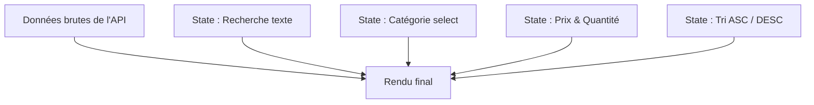

# Filtrage Multi-Critères Dynamique en React

Ce guide explique comment implémenter un système de filtrage puissant et performant combinant plusieurs critères de recherche en temps réel : **recherche textuelle (nom), liste déroulante (catégorie), prix minimal/maximal, quantité disponible (stock)**, ainsi qu'un **tri ascendant / descendant**.

---

## 1. Règle d'or : Utiliser le "Derived State" (État Dérivé)

> [!IMPORTANT]
> **Ne créez jamais** de `useState` pour stocker la liste filtrée finale.
> Calculez cette liste à chaque rendu à partir des critères saisis et de la liste globale. Cela évite les bugs de désynchronisation et les boucles de rendu infinies.



---

## 2. Exemple de Composant Complet : `FiltreMultiCriteres`

Voici un exemple propre, moderne et documenté utilisant tous les filtres demandés :

```jsx
import React, { useState, useEffect } from 'react';
import api_admin from '../../api/api_admin';

function FiltreMultiCriteres() {
    // 1. Liste globale brute venant de l'API
    const [products, setProducts] = useState([]);
    const [loading, setLoading] = useState(true);
    const [message, setMessage] = useState('');

    // 2. States des critères de filtrage
    const [searchName, setSearchName] = useState('');           // Recherche par Nom
    const [selectedCategory, setSelectedCategory] = useState('all'); // Liste déroulante
    const [minPrice, setMinPrice] = useState('');               // Prix Min
    const [maxPrice, setMaxPrice] = useState('');               // Prix Max
    const [minQty, setMinQty] = useState('');                   // Quantité disponible min
    
    // 3. States de Tri (Ascendant / Descendant)
    const [sortField, setSortField] = useState('price');        // 'price', 'name' ou 'qty'
    const [sortOrder, setSortOrder] = useState('asc');          // 'asc' ou 'desc'

    // Récupération des données depuis l'API
    const fetchProducts = async () => {
        try {
            const response = await api_admin.get('/admin/catalog/products?limit=100');
            setProducts(response.data.data);
            setLoading(false);
        } catch (error) {
            setMessage('Erreur lors du chargement des produits');
            setLoading(false);
        }
    };

    useEffect(() => {
        fetchProducts();
    }, []);

    // ==========================================
    // 4. CALCULS DES DONNÉES FILTRÉES & TRIÉES (Derived State)
    // ==========================================
    const filteredProducts = products
        .filter(prod => {
            // A. Filtrage par Nom (Recherche textuelle insensible à la casse)
            const matchesName = prod.name.toLowerCase().includes(searchName.toLowerCase());

            // B. Filtrage par Liste Déroulante (Catégorie ou Type)
            // Note : Adaptez 'prod.type' ou 'prod.category' selon votre structure JSON
            const matchesCategory = selectedCategory === 'all' || prod.type === selectedCategory;

            // C. Filtrage par Prix (Min et Max)
            const price = parseFloat(prod.price) || 0;
            const matchesMinPrice = minPrice === '' || price >= parseFloat(minPrice);
            const matchesMaxPrice = maxPrice === '' || price <= parseFloat(maxPrice);

            // D. Filtrage par Quantité disponible (Stock)
            const qty = prod.inventories?.[0]?.qty ?? 0;
            const matchesMinQty = minQty === '' || qty >= parseInt(minQty);

            return matchesName && matchesCategory && matchesMinPrice && matchesMaxPrice && matchesMinQty;
        })
        .sort((a, b) => {
            // E. Système de Tri Dynamique (Ascendant / Descendant)
            let valA, valB;

            if (sortField === 'price') {
                valA = parseFloat(a.price) || 0;
                valB = parseFloat(b.price) || 0;
            } else if (sortField === 'qty') {
                valA = a.inventories?.[0]?.qty ?? 0;
                valB = b.inventories?.[0]?.qty ?? 0;
            } else {
                // Tri par Nom (Alphabétique)
                valA = a.name.toLowerCase();
                valB = b.name.toLowerCase();
            }

            if (valA < valB) return sortOrder === 'asc' ? -1 : 1;
            if (valA > valB) return sortOrder === 'asc' ? 1 : -1;
            return 0;
        });

    // Liste des catégories uniques pour remplir le select automatiquement (Derived State)
    const categories = ['all', ...new Set(products.map(p => p.type).filter(Boolean))];

    if (loading) return <div className="client-container">Chargement...</div>;

    return (
        <div className="client-container">
            <h1>Catalogue - Recherche Multi-Critères</h1>

            {message && <p className="error-message">{message}</p>}

            {/* SECTION FILTRES */}
            <div className="filter-bar" style={{
                background: '#fafafa',
                padding: '1.5rem',
                borderRadius: '8px',
                border: '1px solid #e0e0e0',
                marginBottom: '2rem',
                display: 'flex',
                flexDirection: 'column',
                gap: '1rem'
            }}>
                <div style={{ display: 'flex', flexWrap: 'wrap', gap: '1rem' }}>
                    
                    {/* 1. Recherche par Nom */}
                    <div style={{ flex: '1 1 200px' }}>
                        <label style={{ display: 'block', fontWeight: '600' }}>Recherche par Nom</label>
                        <input
                            type="text"
                            placeholder="Ex: Chemise..."
                            value={searchName}
                            onChange={(e) => setSearchName(e.target.value)}
                            style={{ width: '100%', padding: '0.5rem', border: '1px solid #ccc', borderRadius: '4px' }}
                        />
                    </div>

                    {/* 2. Liste déroulante */}
                    <div style={{ flex: '1 1 150px' }}>
                        <label style={{ display: 'block', fontWeight: '600' }}>Catégorie</label>
                        <select
                            value={selectedCategory}
                            onChange={(e) => setSelectedCategory(e.target.value)}
                            style={{ width: '100%', padding: '0.5rem', border: '1px solid #ccc', borderRadius: '4px', height: '38px' }}
                        >
                            {categories.map(cat => (
                                <option key={cat} value={cat}>
                                    {cat === 'all' ? 'Toutes les catégories' : cat}
                                </option>
                            ))}
                        </select>
                    </div>

                    {/* 3. Filtre Prix Min & Max */}
                    <div style={{ flex: '1 1 120px' }}>
                        <label style={{ display: 'block', fontWeight: '600' }}>Prix Min (€)</label>
                        <input
                            type="number"
                            placeholder="Min"
                            value={minPrice}
                            onChange={(e) => setMinPrice(e.target.value)}
                            style={{ width: '100%', padding: '0.5rem', border: '1px solid #ccc', borderRadius: '4px' }}
                        />
                    </div>

                    <div style={{ flex: '1 1 120px' }}>
                        <label style={{ display: 'block', fontWeight: '600' }}>Prix Max (€)</label>
                        <input
                            type="number"
                            placeholder="Max"
                            value={maxPrice}
                            onChange={(e) => setMaxPrice(e.target.value)}
                            style={{ width: '100%', padding: '0.5rem', border: '1px solid #ccc', borderRadius: '4px' }}
                        />
                    </div>

                    {/* 4. Filtre Quantité Minimal (Stock) */}
                    <div style={{ flex: '1 1 150px' }}>
                        <label style={{ display: 'block', fontWeight: '600' }}>Quantité Min en Stock</label>
                        <input
                            type="number"
                            placeholder="Quantité dispo"
                            value={minQty}
                            onChange={(e) => setMinQty(e.target.value)}
                            style={{ width: '100%', padding: '0.5rem', border: '1px solid #ccc', borderRadius: '4px' }}
                        />
                    </div>
                </div>

                {/* SECTION DES CONTROLES DE TRI */}
                <div style={{
                    display: 'flex',
                    alignItems: 'center',
                    justifyContent: 'space-between',
                    borderTop: '1px solid #e0e0e0',
                    paddingTop: '1rem',
                    flexWrap: 'wrap',
                    gap: '1rem'
                }}>
                    <div style={{ display: 'flex', alignItems: 'center', gap: '1rem' }}>
                        <label style={{ fontWeight: '600' }}>Trier par :</label>
                        <select
                            value={sortField}
                            onChange={(e) => setSortField(e.target.value)}
                            style={{ padding: '0.4rem', border: '1px solid #ccc', borderRadius: '4px' }}
                        >
                            <option value="name">Nom</option>
                            <option value="price">Prix</option>
                            <option value="qty">Quantité en stock</option>
                        </select>
                    </div>

                    {/* Boutons de direction de Tri (ASC / DESC) */}
                    <div style={{ display: 'flex', gap: '0.5rem' }}>
                        <button
                            onClick={() => setSortOrder('asc')}
                            style={{
                                padding: '0.5rem 1rem',
                                border: '1px solid #000',
                                borderRadius: '4px',
                                background: sortOrder === 'asc' ? '#000' : '#fff',
                                color: sortOrder === 'asc' ? '#fff' : '#000',
                                fontWeight: '600',
                                cursor: 'pointer'
                            }}
                        >
                            ↑ Croissant (ASC)
                        </button>
                        <button
                            onClick={() => setSortOrder('desc')}
                            style={{
                                padding: '0.5rem 1rem',
                                border: '1px solid #000',
                                borderRadius: '4px',
                                background: sortOrder === 'desc' ? '#000' : '#fff',
                                color: sortOrder === 'desc' ? '#fff' : '#000',
                                fontWeight: '600',
                                cursor: 'pointer'
                            }}
                        >
                            ↓ Décroissant (DESC)
                        </button>
                    </div>
                </div>
            </div>

            {/* RÉSULTAT DU FILTRAGE */}
            <p><strong>{filteredProducts.length}</strong> produit(s) trouvé(s)</p>

            <table className="cart-items" style={{ width: '100%', marginTop: '1rem', borderCollapse: 'collapse' }}>
                <thead>
                    <tr style={{ background: '#f0f0f0', textAlign: 'left' }}>
                        <th style={{ padding: '0.75rem' }}>Nom</th>
                        <th style={{ padding: '0.75rem' }}>Catégorie</th>
                        <th style={{ padding: '0.75rem' }}>Prix</th>
                        <th style={{ padding: '0.75rem', textAlign: 'center' }}>Stock</th>
                    </tr>
                </thead>
                <tbody>
                    {filteredProducts.map(prod => (
                        <tr key={prod.id} style={{ borderBottom: '1px solid #e0e0e0' }}>
                            <td style={{ padding: '0.75rem' }}>{prod.name}</td>
                            <td style={{ padding: '0.75rem' }}>{prod.type || 'N/A'}</td>
                            <td style={{ padding: '0.75rem' }}>{prod.price} €</td>
                            <td style={{ padding: '0.75rem', textAlign: 'center' }}>
                                {prod.inventories?.[0]?.qty ?? 0} units
                            </td>
                        </tr>
                    ))}
                </tbody>
            </table>

            {filteredProducts.length === 0 && (
                <p style={{ textAlign: 'center', marginTop: '2rem', color: '#666' }}>
                    Aucun produit ne correspond à vos filtres.
                </p>
            )}
        </div>
    );
}

export default FiltreMultiCriteres;
```

---

## 3. Zoom sur le Mécanisme de Tri Combiné (ASC / DESC)

Le tri s'effectue dynamiquement en combinant le **champ choisi** (`sortField`) et la **direction choisie** (`sortOrder`) :

```javascript
.sort((a, b) => {
    let valA = a[sortField];
    let valB = b[sortField];

    // ... conversions de types selon le champ (nombre ou chaîne) ...

    if (valA < valB) return sortOrder === 'asc' ? -1 : 1;
    if (valA > valB) return sortOrder === 'asc' ? 1 : -1;
    return 0;
})
```

### 💡 Expérience Utilisateur
Les deux boutons ASC (`↑`) et DESC (`↓`) sont affichés côte à côte. Le bouton actif change de couleur (fond noir avec écriture blanche) pour indiquer clairement quel sens de tri est appliqué à la liste.
